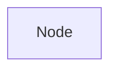
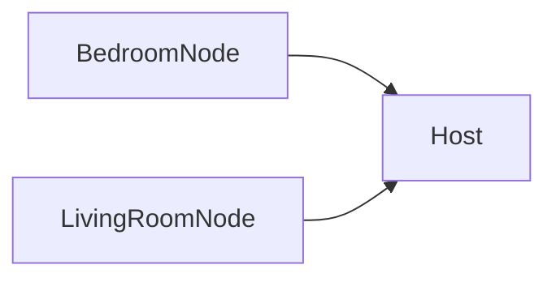

# CalciferPi 🔥🍓

## The simplest Raspberry Pi temperature sensor

Calcifer uses a [Raspberry Pi Zero 2 W](https://thepihut.com/products/raspberry-pi-zero-wh-with-pre-soldered-header) and a [DHT22](https://thepihut.com/products/dht22-temperature-humidity-sensor) sensor to provide a temperature sensor node and host network in your home.

## Install

CalciferPi is an installable:

```sh
pipx install calciferpi
```

## Single instance

CalciferPi can be ran as a single node, providing a simple GUI and HTTP API for querying the sensor:

```sh
calciferpi run node
```

On your local network you can then visit `http://raspberrypi.local/calcifer` to see the GUI.

## Host

A single CalciferPi instance is a "node":



You can also run CalciferPi in `Host mode` which allows you to query other nodes in your network:



To run CalciferPi in host mode, change your run command to:

```sh
calciferpi run host
```

Then visit `http://raspberrypi.local/calcifer`.

See configuration below for how to connect to other CalciferPi nodes.

## Configuration

### Background service

You can use Supervisor to run Calcifer as a background service. [See this guide for hints on getting started](https://www.piawesome.com/how-tos/Supervisor%20as%20a%20Background%20Service%20Manager.html)

### Connecting to nodes

You can configure nodes to connect to using a file called `~/.config/calciferpi`

```yaml
---
nodes:
  bedroom:
    - url: http://bedroompi.local
  living-room:
    - url: http://livingroompi.local
```

CalciferPi will automatically query the nodes listed and display them.

## Installing DHT22 sensor

We recommend the sensor [with the board](https://thepihut.com/products/dht22-temperature-humidity-sensor) so you don't have to do any complex wiring yourself.

The pins should be connected the same as [the diagrams on this tutorial](https://newbiely.com/tutorials/raspberry-pi/raspberry-pi-dht22)

### Data out pin

Configure which data out pin to use by editing the `DATA_OUT_PIN` constant in `~/.config/calciferpi`:

```yaml
---
DATA_OUT_PIN: 17
```
