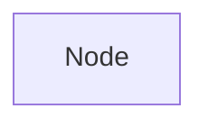
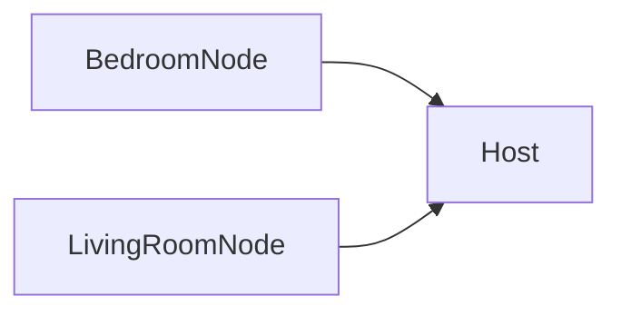

# CalciferPi 🔥🍓

## The simplest Raspberry Pi temperature sensor

Calcifer uses a [Raspberry Pi Zero 2 W](https://thepihut.com/products/raspberry-pi-zero-wh-with-pre-soldered-header) and a [DHT22](https://thepihut.com/products/dht22-temperature-humidity-sensor) sensor to provide a temperature sensor node and host network in your home.

## Install

CalciferPi is a script that can be installed in the local virtual environment:

```sh
git clone git@github.com:phalt/calcifer.git
make install-pi
```

### CLI commands

See info about CalciferPi's commands:

```sh
> calciferpi

Usage: calciferpi [OPTIONS] COMMAND [ARGS]...

  CalciferPi 🔥🍓:  The simplest Raspberry Pi temperature sensor

  https://github.com/phalt/calcifer

Options:
  --help  Show this message and exit.

Commands:
  host  Run the micro web server in host mode
  info  Print configuration information about calciferpi
  live  Display a live updating display of the temperature and humidity...
  read  Read the temperature and humidity from the DHT22 sensor Runs once...
```

## CLI reading

CalciferPi can be ran as a single node, providing a simple CLI output for the reading

```sh
. .venv/bin/activate
calciferpi read
```

## Host

A single CalciferPi instance is a "node":



You can also run CalciferPi in `Host mode` which allows you to query other nodes in your network:



To run CalciferPi in host mode, change your run command to:

```sh
calciferpi host
```

Then visit `http://raspberrypi.local/`.

See configuration below for how to connect to other CalciferPi nodes.

## Configuration

The configuration file provides some basic methods of configuration:

```conf
; The GPIO pin you are using with your DHT22 sensor, defaults to 4.
DATA_PIN = 4
; Run the code in debug mode. Defaults to False.
DEBUG = True
; Run the server in debug mode. Defaults to False
SERVER_DEBUG = True
; A configurable port to run the server on. Defaults to 80
SERVER_PORT = 5000
; A configurable host to run the server on. Defaults to 0.0.0.0
SERVER_HOST = "127.0.0.1"
; What the local device is called. Sefaults to "local".
DEVICE_NAME = "Test device"
; If this list is populated, these nodes will be queried to get data. Defaults to []
NODES = ["http://other-calciferpi.local"]
```

### Nodes

Assuming you have filled out the `NODES` array in your configuration, each NODE will receive an HTTP GET request, and will return a local reading from their sensor.

Note that the node itself has to be running in `calciferpi host` mode in order to email this.

## Installing DHT22 sensor

We recommend the sensor [with the board](https://thepihut.com/products/dht22-temperature-humidity-sensor) so you don't have to do any complex wiring yourself.

The pins should be connected the same as [the diagrams on this tutorial](https://newbiely.com/tutorials/raspberry-pi/raspberry-pi-dht22)

### Data out pin

Configure which data out pin to use by editing the `DATA_PIN` constant in `~/.config/calciferpi`:

```conf
DATA_PIN = 4
```

The default is `GPIO4`: [https://pinout.xyz/pinout/pin7_gpio4/](https://pinout.xyz/pinout/pin7_gpio4/)
